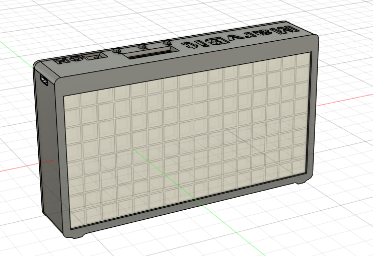
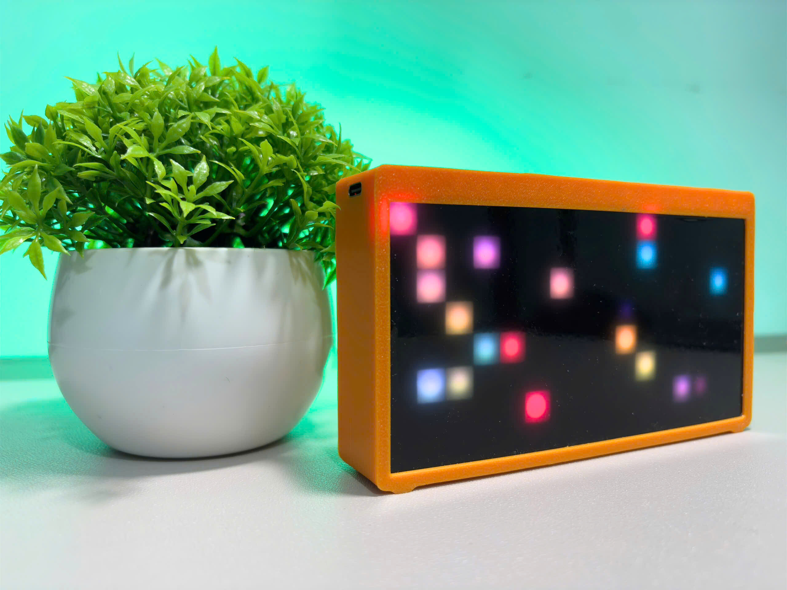
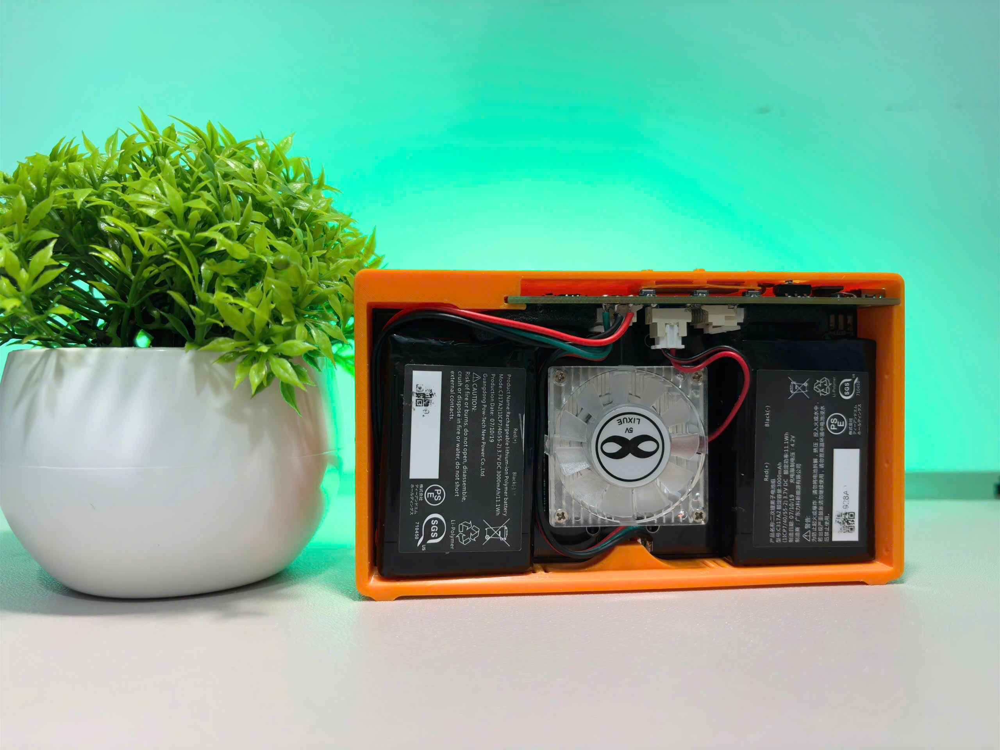
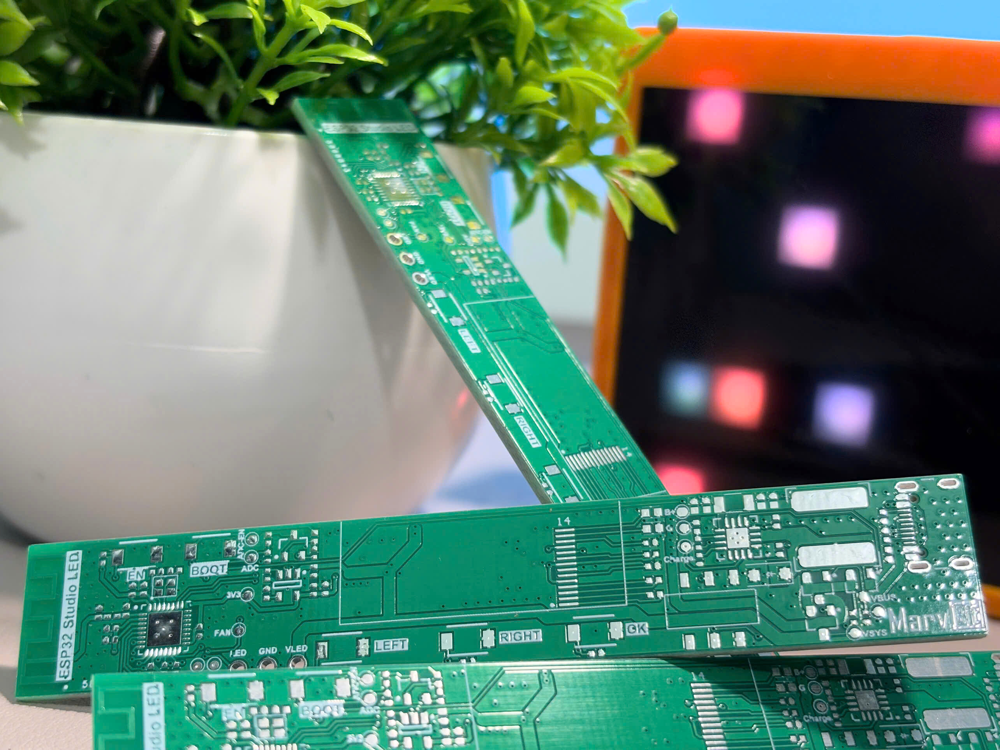
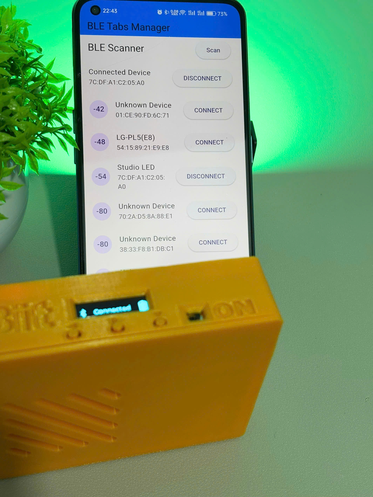
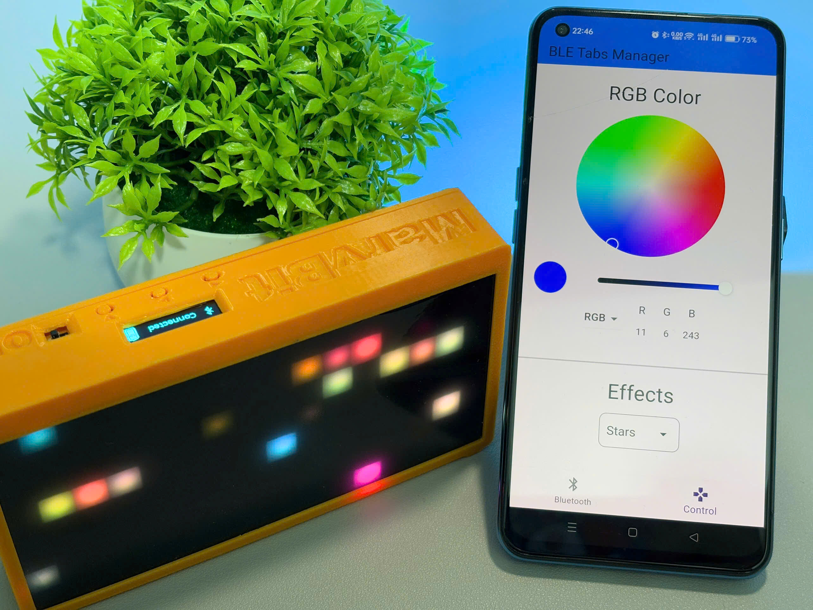

# ESP32-C3 Studio LED: Compact BLE-Controlled LED Panel

The ESP32-C3 Studio LED is a project I built to help with filming and taking pictures. Traditional RGB lights often come with limitations like fixed effects and no wireless control, which can make them less convenient for creative work. This LED panel solves those issues by offering BLE (Bluetooth Low Energy) control and fully customizable effects, all managed through an Android app.

The panel features a 16x8 (128) addressable RGB LED array and a 3D-printed enclosure, making it lightweight, portable, and easy to use. It's a fun and practical tool for anyone who enjoys making their own equipment and wants more flexibility in their lighting setup.

## Information

* 16x8 (128) addressable RGB LED array.
* 0.91" OLED display.
* Type-C power charging port, capable of battery charging and debugging.
* BLE (Bluetooth Low Energy) wireless connection.
* Control the LED panel via an Android app.

## Mechanical Design

* Designed using Fusion 360.
* Fully 3D printed using a Bambu Lab A1 Mini.
* LED diffuser made of polycarbonate sheet.

  
  

## Circuit Design

* Designed using Altium:
  * ESP32-C3 as the main controller.
  * 0.91" OLED (SSD1306).
  * Battery charger using TP5100.
  * 2x 3000mAh batteries.
  * PWM-controlled cooling fan.
  * USB Type-C charging port.
  * Power path design to automatically balance charging current and load current.

## Firmware

* Firmware is written using Zephyr RTOS.
  * UI is designed using LVGL and SquareLine Studio.
  * Supports fan cooling control.
  * Supports battery monitoring.
  * Supports modular LED effects.
  * Supports BLE peripherals and BLE services.

## Mobile App

* The Android app is written using Flutter.
* Supports BLE connection to control the LED panel.
* Users can control RGB colors and pre-defined LED effects.

  
  

## Known Issues

* When the full LED panel is operating, the PCB gets hot because the traces cannot carry large currents.
* RGB colors are inaccurate when the full LED panel is operating due to insufficient current.
* Since no RTC power solution is designed, the ESP32-C3 cannot keep time when powered off. Development of the clock function is canceled.
